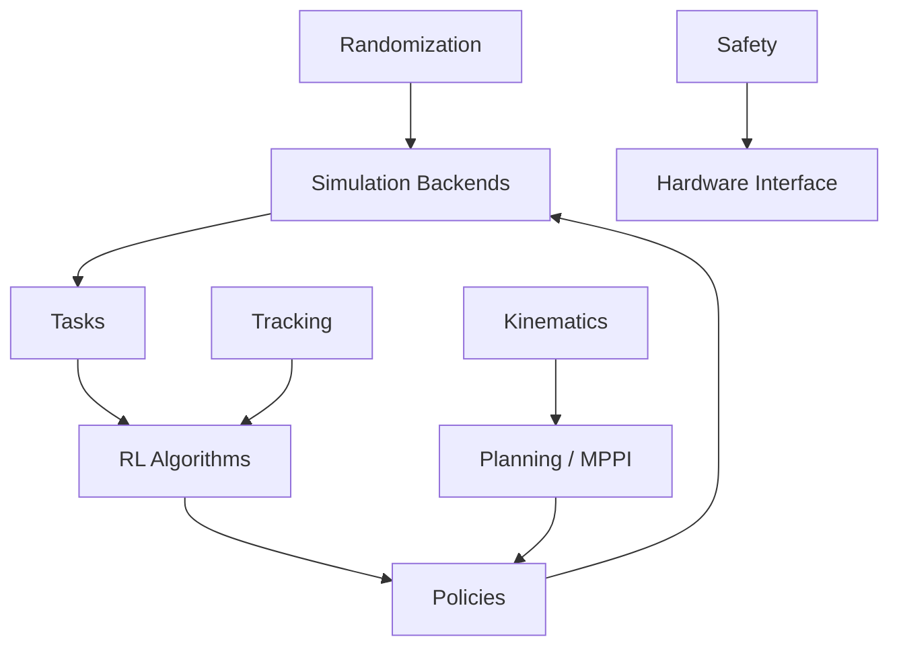

ARCS: Adaptive Robotics Control System
======================================

Overview
--------
ARCS is a robotics control and learning stack that combines simulation backends,
policy learning, kinematics, and planning into a unified workflow. It focuses on
sim-to-real readiness, reproducible training, and modular interfaces.

Key Capabilities
----------------
- Unified simulation backend interface (Dummy, IsaacGym, MuJoCo, PyBullet stubs)
- PPO training with vectorized GAE and minibatching
- Domain randomization hooks and ADR support
- URDF-based forward kinematics and Jacobians
- Demonstration dataset filtering and augmentation
- Safety filtering for action constraints
- Experiment tracking (wandb or local)

Installation
------------
Using pip:

```bash
pip install -e .
```

Using uv:

```bash
uv pip install -e .
```

Quick Start
-----------
Run the Reach verification script:

```bash
python verify_reach.py
```

Architecture
------------


Configuration
-------------
ARCS uses a typed configuration system with environment overrides:

```bash
ARCS_PPO_LR=1e-4
```

Use the CLI to inspect or write configs:

```bash
arcs config-show
arcs config-save config.yaml
```

Contributing
------------
Run lint and tests locally:

```bash
ruff check src tests
mypy src
pytest
```

Docs
----
Build the docs site:

```bash
mkdocs build
```
